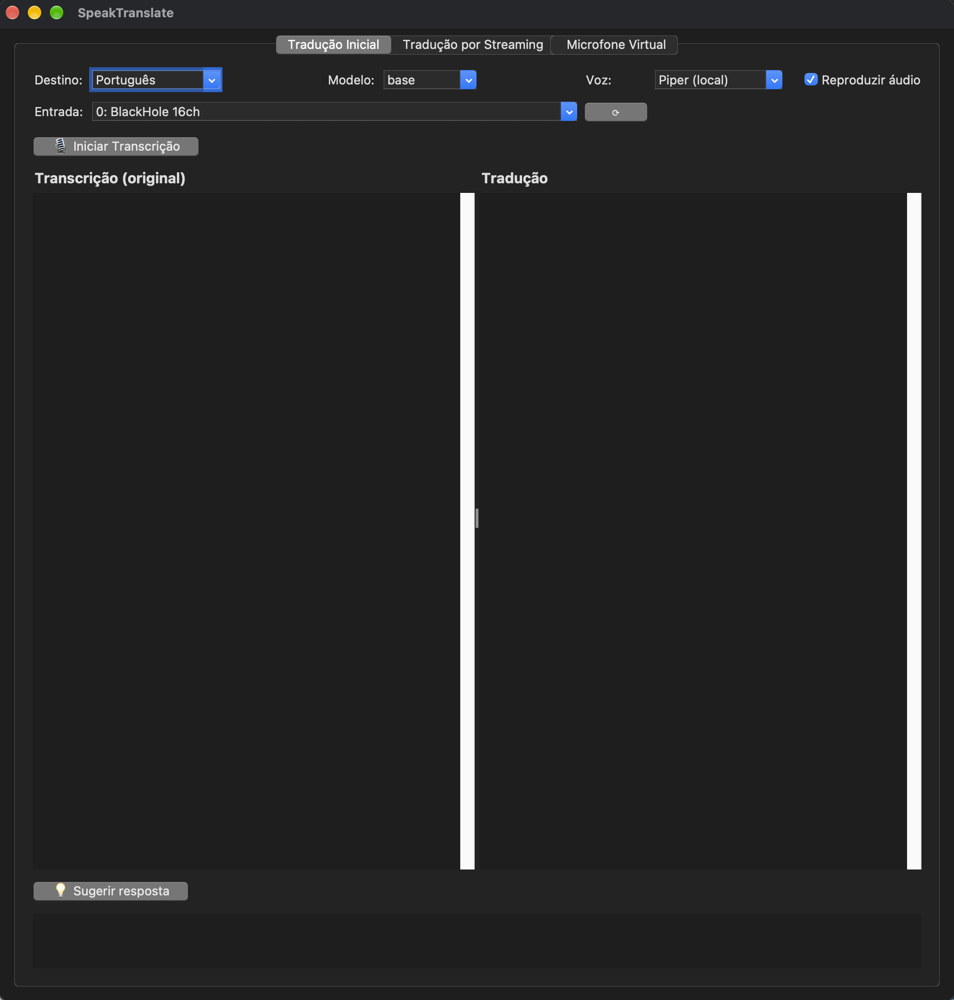
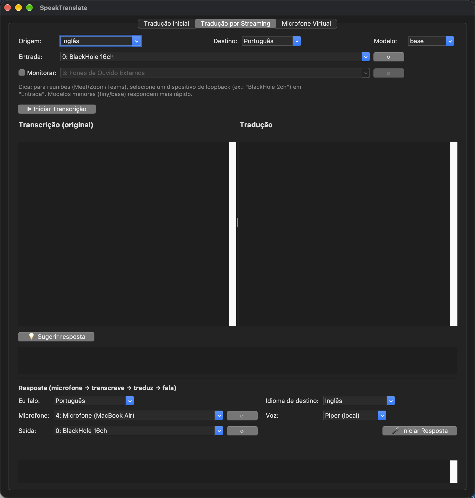
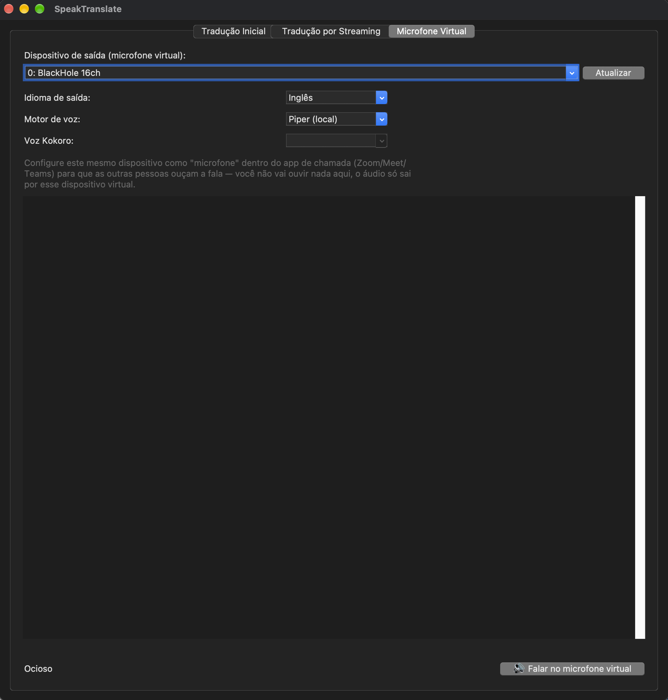

# SpeakTranslate



Captura áudio, transcreve, traduz e reproduz/mostra o resultado. A interface gráfica tem quatro abas:

- **Tradução Inicial**: grava uma fala por vez (microfone ou qualquer entrada), transcreve, traduz e fala o resultado em voz — transcrição e tradução aparecem lado a lado, em destaque (mesmo visual da aba "Tradução por Streaming"). Pipeline: **captura de áudio** → **detecção de idioma + transcrição** ([faster-whisper](https://github.com/SYSTRAN/faster-whisper)) → **tradução local** ([OPUS-MT](https://github.com/Helsinki-NLP/Opus-MT) via [CTranslate2](https://github.com/OpenNMT/CTranslate2), ver [Tradução](#tradução-local-offline) abaixo) → **texto-para-voz** ([edge-tts](https://github.com/rany2/edge-tts) na nuvem, ou [Piper](https://github.com/rhasspy/piper) local — escolha o motor na interface, ver [Texto-para-voz](#texto-para-voz) abaixo).
- **Tradução por Streaming**: pensada para acompanhar reuniões (Meet/Zoom/Teams) ao vivo — transcreve e traduz continuamente **enquanto a pessoa fala**, sem esperar uma pausa, e tem um bloco de "Resposta" (rodapé) que fala de volta traduzido, capturando o seu microfone.

Nas duas primeiras abas, um botão opcional **💡 Sugerir resposta** (API Gemini, ver [Sugestão de resposta](#sugestão-de-resposta-opcional-via-gemini) abaixo) sugere uma resposta curta no idioma de quem falou, pronta pra ler/pronunciar — útil para quem tem domínio intermediário desse idioma.
- **Microfone Virtual**: digite um texto, escolha o idioma e toque a fala sintetizada direto num dispositivo de áudio virtual (ex.: BlackHole) — ferramenta simples para testar/usar o mecanismo de "fingir ser seu microfone" numa chamada sem precisar falar nem transcrever nada (ver [abaixo](#aba-microfone-virtual)).
- **Entrevista**: escolha um arquivo de vídeo e transmita ele em loop contínuo como **câmera virtual** do macOS — qualquer app (Chrome, Zoom, Meet, FaceTime...) seleciona essa câmera como se fosse uma webcam normal (ver [Aba Entrevista](#aba-entrevista-câmera-virtual) abaixo).

O diretório [`example/`](example) contém o projeto de referência (VoiceNote), que fornece apenas a parte de captura + transcrição via faster-whisper.

## Pré-requisitos

- Python `3.11` ou mais recente
- [Poetry](https://python-poetry.org/docs/#installation)
- Conexão com a internet: necessária para baixar os modelos na primeira vez (Whisper e tradução) e para a síntese de voz via edge-tts (é um serviço online). A **tradução em si** roda localmente depois de baixada — ver abaixo.

## Instalação

```bash
poetry install
```

Isso instala o `torch` (só usado uma vez, para converter os modelos de tradução do formato original para o CTranslate2 — depois disso ele não é mais necessário em tempo de execução), então a instalação é mais pesada que o normal (~1-1.5GB de dependências). Se isso for um problema, dá pra remover `torch`/`transformers`/`sentencepiece`/`sacremoses` do `pyproject.toml` depois de converter os pares de idioma que for usar (os modelos já convertidos ficam em `~/.cache/speaktranslate/ct2_models/` e não dependem mais dessas libs).

## Tradução (local, offline)

A tradução usa modelos [OPUS-MT](https://github.com/Helsinki-NLP/Opus-MT) (Helsinki-NLP) rodando via [CTranslate2](https://github.com/OpenNMT/CTranslate2) — o mesmo motor de inferência já usado para o Whisper. Motivo da escolha, comparado a um serviço de tradução online (testamos com o MyMemory antes):

- **~15-25× mais rápido**: nos nossos testes, ~60-150ms por frase localmente (depois do modelo carregado) contra ~1,5-3,5s por chamada ao MyMemory (latência de rede).
- **Sem depender de internet** depois de baixado, sem limite de requisições e sem enviar o conteúdo transcrito para um serviço de terceiros — relevante sobretudo para a aba "Tradução por Streaming" (reuniões), que traduz uma frase por vez continuamente.
- Qualidade equivalente ao MyMemory nos nossos testes.

**Como funciona**: cada par de idioma envolvendo inglês tem um modelo OPUS-MT dedicado (ex.: inglês→português, espanhol→inglês). Um par que não envolve inglês (ex.: espanhol→russo) é traduzido em duas etapas, usando o inglês como pivô (espanhol→inglês→russo) — prática padrão quando não existe um modelo bilíngue direto. Os modelos são baixados e convertidos para CTranslate2 (quantizados em int8) **na primeira vez que aquele par de idiomas é usado** — leva de alguns segundos a ~30s dependendo do par — e ficam em cache em `~/.cache/speaktranslate/ct2_models/` (cada par ocupa entre ~75MB e ~230MB); usos seguintes são instantâneos e 100% offline.

**Limitação conhecida**: modelos OPUS-MT traduzem melhor frase por frase — mandar um texto com várias frases de uma vez pode fazer conteúdo ser descartado ou resumido. Por isso, [translation.py](src/speaktranslate/translation.py) divide automaticamente o texto em frases antes de traduzir cada uma separadamente.

## Texto-para-voz

Três opções, selecionáveis na interface ("Motor de voz") em cada lugar que fala em voz alta (aba "Tradução Inicial" e o bloco "Resposta" da aba de streaming):

| Motor | Tipo | Velocidade | Qualidade | Idiomas |
|---|---|---|---|---|
| **[Piper](https://github.com/rhasspy/piper)** (padrão) | Local/offline | ~0,1-0,6s por frase (CPU) | Boa, um pouco mais "robótica" que vozes neurais de nuvem | Todos exceto japonês (sem voz oficial no catálogo do Piper) |
| **edge-tts** | Online (nuvem, gratuito, não-oficial) | ~1-2s por frase (latência de rede) | Vozes neurais, bem natural | Todos os 10 idiomas do app |
| **[Kokoro](https://huggingface.co/hexgrad/Kokoro-82M)** | Local/offline | Mais lento que o Piper (modelo maior, CPU) | Vozes neurais, mais natural que o Piper | Português, inglês, espanhol, francês, italiano, chinês — **sem** japonês, russo, alemão nem coreano |

Piper baixa o modelo de voz (~20-60MB) na primeira vez que um idioma é usado, e fica em cache em `~/.cache/speaktranslate/piper_voices/` — depois disso é 100% offline. Vale a pena quando internet é instável, quando o custo/risco de depender de um serviço não-oficial (`edge-tts` é engenharia reversa do TTS do navegador Edge, sem contrato de suporte) preocupa, ou simplesmente para reduzir a latência da fala no bloco "Resposta" (streaming ao vivo).

Kokoro é um modelo aberto (Apache 2.0) alternativo ao Piper: também 100% local, mas maior e mais lento — vale a pena testar quando a qualidade de voz do Piper incomoda e a latência extra não é um problema. Baixa os pesos (~327MB) do Hugging Face Hub na primeira vez que um idioma é usado (cache em `~/.cache/huggingface/`) e depende do **espeak-ng** instalado no sistema para idiomas além do inglês (`brew install espeak-ng` no macOS).

**Requer Python 3.11 ou 3.12** — a dependência `misaki` (usada pelo Kokoro para texto-para-fonemas) ainda não dá suporte a Python 3.13. Em Python 3.13+ o `poetry install` simplesmente pula essa dependência (não trava a instalação), mas a opção "Kokoro (local)" fica indisponível na interface (erro tratado ao tentar falar). Pra usar o Kokoro, recrie a venv do projeto com Python 3.11/3.12, por exemplo via [pyenv](https://github.com/pyenv/pyenv):

```bash
pyenv install 3.12.13                              # baixa e compila o Python 3.12 (uma vez só)
poetry env use ~/.pyenv/versions/3.12.13/bin/python  # recria a venv do projeto nessa versão
poetry install
```

**Sem suporte a japonês**: o extra `misaki[ja]` traz o `pyopenjtalk`, uma extensão nativa C/C++ compilada via cmake — removida do projeto porque falha ao compilar em alguns toolchains do Xcode Command Line Tools (erro `tapi: malformed file`, ligado a um SDK desalinhado com o compilador). Os demais idiomas do Kokoro não precisam de extensão nativa e não são afetados.

Vozes disponíveis por idioma (catálogo completo em `_KOKORO_VOICES` em [tts.py](src/speaktranslate/tts.py); lista oficial com nota de qualidade de cada uma em [VOICES.md](https://huggingface.co/hexgrad/Kokoro-82M/blob/main/VOICES.md)) — na aba "Microfone Virtual" dá pra escolher qualquer uma delas no combobox "Voz Kokoro:":

| Idioma | Masculinas | Femininas |
|---|---|---|
| Inglês | am_michael (padrão), am_fenrir, am_puck, am_echo, am_eric, am_liam, am_onyx, am_santa, am_adam | af_heart, af_bella, af_nicole, af_aoede, af_kore, af_sarah, af_nova, af_alloy, af_sky, af_jessica, af_river |
| Português-BR | pm_alex (padrão), pm_santa | pf_dora |
| Espanhol | em_alex (padrão), em_santa | ef_dora |
| Italiano | im_nicola (padrão) | if_sara |
| Chinês | zm_yunjian (padrão), zm_yunxi, zm_yunxia, zm_yunyang | zf_xiaobei, zf_xiaoni, zf_xiaoxiao, zf_xiaoyi |
| Francês | — nenhuma no catálogo | ff_siwis (padrão, única opção) |

O Kokoro não faz clonagem de voz (não replica o timbre de uma pessoa real a partir de uma amostra) — é um catálogo fixo de vozes sintéticas pré-treinadas.

Se o idioma de saída for **japonês**, não use o Piper nem o Kokoro (nenhum dos dois tem voz) — use "Edge (nuvem)". Se for **russo, alemão ou coreano**, não use o Kokoro (sem voz disponível) — use Piper ou Edge. Nesses casos a fala falha com um erro tratado (não trava o app, mas não sai áudio) se o motor escolhido não tiver voz para o idioma.

### Vozes padrão: masculinas em todos os motores (quando existe opção)

Os três motores usam vozes **masculinas por padrão**, idioma por idioma:

- **edge-tts**: confirmado via `edge-tts --list-voices`, que já rotula Male/Female oficialmente — todos os 10 idiomas têm voz masculina.
- **Kokoro**: o próprio nome da voz indica o gênero (`am_`/`em_`/`im_`/`pm_`/`zm_` = masculina) — masculina por padrão em todo idioma que tiver uma. **Exceção: francês**, que só tem a voz feminina `ff_siwis` no catálogo atual do Kokoro, sem alternativa.
- **Piper**: **não existe metadado de gênero oficial** no projeto (nem no `voices.json`, nem nos `MODEL_CARD`s) — confirmamos pt/de/ru (faber/thorsten/denis) e en (trocado para `ryan`) com uma fonte externa. **Seguem femininas por decisão deliberada**, não por falta de alternativa masculina confirmada: francês (`siwis`) e coreano (`kss`) não têm **nenhuma** voz masculina no catálogo do Piper; italiano (`paola`) tem uma alternativa confirmada (`riccardo`), mas só em qualidade `x_low` (16kHz, perceptivelmente pior que o `medium` atual); chinês (`huayan`) tem uma candidata (`chaowen`, mesma qualidade `medium`), mas sem confirmação de gênero. Pra trocar qualquer uma dessas, edite `_PIPER_VOICES` em [tts.py](src/speaktranslate/tts.py).

## Sugestão de resposta (opcional, via Gemini)

O botão **💡 Sugerir resposta** (abas "Tradução Inicial" e "Tradução por Streaming") pede a um modelo [Gemini](https://ai.google.dev/) uma sugestão curta de resposta, no idioma de quem falou, a partir do último bloco transcrito/traduzido — pensado para quem tem domínio intermediário desse idioma e só precisa ler/pronunciar a sugestão, sem precisar compor a frase. Cada clique **substitui** a sugestão anterior; não acumula texto de blocos antigos.

**Diferente de tudo mais no app, isto envia o texto transcrito para um serviço externo** (a API do Google) — é a única parte que depende de internet/chave de API além da síntese de voz via edge-tts. Se preferir manter o app 100% local, simplesmente não configure a chave: o botão mostra um erro amigável e o resto do app continua funcionando normalmente.

Para habilitar:

1. Gere uma chave em [aistudio.google.com/apikey](https://aistudio.google.com/apikey).
2. Copie `.env.example` para `.env` na raiz do projeto e cole sua chave em `GEMINI_API_KEY=...`. O arquivo `.env` é ignorado pelo git (veja `.gitignore`) — nunca cole a chave direto num arquivo versionado, commit ou conversa.
3. Rode `poetry install` (adiciona o pacote `google-genai`) e use o botão normalmente.

## Uso

### Interface gráfica (tkinter)

```bash
poetry run python run_gui.py
```

Por padrão, a lista de "Entrada de áudio" (em ambas as abas) mostra os microfones disponíveis no sistema. Para transcrever o que está tocando no computador (ex.: áudio de um navegador ou de uma reunião) em vez do microfone, é necessário instalar um driver de áudio virtual com loopback, como o [BlackHole](https://github.com/ExistentialAudio/BlackHole) (gratuito).

**Importante — use dois BlackHole separados, um para cada direção, nunca um Dispositivo de Múltiplas Saídas combinando BlackHole com seus alto-falantes.** Testamos isso na prática: combinar dispositivos virtuais e físicos num Multi-Output Device causa tanto um artefato de áudio ("som de aquário", por drift de clock entre os dispositivos) quanto vazamento de áudio entre as direções (o BlackHole captando de volta o que ele mesmo acabou de tocar). A configuração correta:

```bash
brew install --cask blackhole-2ch    # "microfone" — sua fala sintetizada sai por aqui
brew install --cask blackhole-16ch   # "alto-falante" — a reunião entra por aqui
```

| Direção | Dispositivo | Onde configurar |
|---|---|---|
| Reunião → você (escutar/transcrever, bloco principal da aba Streaming) | **BlackHole 16ch** | No Zoom/Meet/Teams: defina como **alto-falante/saída** do app. No SpeakTranslate: selecione como entrada no bloco "Transcrição/tradução" |
| Você → reunião (Resposta / Microfone Virtual) | **BlackHole 2ch** | No Zoom/Meet/Teams: defina como **microfone/entrada** do app. No SpeakTranslate: já é o padrão nessas duas abas |
| Saída do sistema (macOS) | Seus alto-falantes/fones reais | Preferências do Sistema → Som → Saída — nunca o BlackHole nem um Multi-Output Device |

Com essa separação, o app de chamada deixa de mandar o áudio da reunião pros seus alto-falantes de verdade (ele manda só pro BlackHole 16ch) — para continuar ouvindo a reunião ao vivo, marque **"Monitorar"** no bloco "Transcrição/tradução": o app repassa em tempo real o que captura do BlackHole pros seus alto-falantes reais, em paralelo à transcrição.

#### Aba "Tradução Inicial"


Grava uma fala por vez (toggle iniciar/parar), transcreve, traduz e fala o resultado em voz. Escolha o idioma de destino, o modelo Whisper, o motor de voz (edge-tts, Piper ou Kokoro — ver [Texto-para-voz](#texto-para-voz) acima) e o dispositivo de entrada de áudio (use **Atualizar** se conectar/desconectar um dispositivo). O checkbox **"Reproduzir áudio"**, ao lado do motor de voz, vem marcado por padrão — desmarque se quiser só ver a transcrição/tradução, sem a fala em voz alta (pula a etapa de síntese, não só o volume). O botão funciona como o atalho `Ctrl+Shift+Space` do VoiceNote (em [`example/`](example)): clique uma vez em **🎙 Iniciar Transcrição** para começar a gravar, e clique novamente em **⏹ Parar Transcrição** para encerrar a captura — a partir daí a transcrição, tradução e (se marcado) a fala rodam sozinhas até o fim (o botão fica em "Processando..." nesse meio-tempo) e o app volta a ficar pronto para uma nova gravação. A transcrição e a tradução de cada gravação aparecem lado a lado, em destaque; o botão **💡 Sugerir resposta** (ver [acima](#sugestão-de-resposta-opcional-via-gemini)) usa a última gravação como referência.

#### Aba "Tradução por Streaming"



Feita para acompanhar reuniões ao vivo em outro idioma. Tem dois blocos independentes, que podem rodar ao mesmo tempo:

**Transcrição/tradução** (bloco principal, em destaque no centro): selecione como entrada de áudio o dispositivo de loopback dedicado a escutar (ex.: "BlackHole 16ch" — ver a tabela de roteamento acima). Marque **"Monitorar"** se quiser continuar escutando a reunião ao vivo (escolha o dispositivo de saída real — vem selecionado por padrão um que não seja outro BlackHole). Escolha o idioma de origem (ou "Detectar automaticamente"), o de destino e clique em **▶ Iniciar Transcrição**. O texto vai aparecendo em tempo real, aos poucos, à medida que a pessoa fala — não é necessário esperar uma pausa. A coluna da esquerda mostra a transcrição original; a da direita, a tradução; e a linha em itálico acima de cada bloco mostra a hipótese "provisória" mais recente (ainda pode mudar até ser confirmada). Clique em **⏹ Parar** para encerrar. O botão **💡 Sugerir resposta** logo abaixo usa a última sentença fechada como referência (ver [Sugestão de resposta](#sugestão-de-resposta-opcional-via-gemini) acima).

**Resposta** (bloco no rodapé, secundário): a via de volta — fale no seu microfone, e o app transcreve, traduz e **fala** o resultado num dispositivo de saída escolhido (por padrão um driver de loopback como o BlackHole — mesmo mecanismo da aba "Microfone Virtual", só que alimentado ao vivo pela sua fala). Pensado para uso com **fone de ouvido** e o microfone interno do Mac (selecionado por padrão). Tem seus próprios seletores de idioma ("Eu falo" / "Idioma de destino", independentes do bloco principal), o microfone de entrada, o dispositivo de saída e o motor de voz — escolha todos e clique em **🎤 Iniciar Resposta**. O log mostra cada trecho reconhecido e sua tradução.

A fala é **fragmentada e enfileirada**: em vez de esperar a frase inteira terminar, cada ~6 palavras (ou uma pausa, o que vier primeiro) já é traduzido e mandado para tocar — e a captura do microfone **continua em paralelo**, sem esperar o áudio anterior terminar de tocar. Assim, numa frase longa, o começo já está sendo falado enquanto você ainda está terminando de falar o resto; cada pedaço toca na ordem certa, um de cada vez. Isso só é seguro com fone de ouvido — sem fone, o microfone captaria a própria fala sintetizada saindo pelos alto-falantes e criaria um loop.

Os dois blocos têm seletores de idioma próprios (cada um edita só enquanto o seu bloco está parado) e compartilham apenas o modelo Whisper (reaproveitado já carregado; só fica editável quando nenhum dos dois está rodando) — microfone/dispositivo e mecanismos de captura são totalmente independentes, dá pra escutar a reunião e responder ao mesmo tempo.

Como funciona: em vez de esperar silêncio para transcrever (como na aba "Tradução Inicial"), o motor ([`stream_transcription.py`](src/speaktranslate/stream_transcription.py)) re-transcreve continuamente a janela de áudio mais recente e usa a política **LocalAgreement-2** (a mesma técnica do projeto [whisper_streaming](https://github.com/ufal/whisper_streaming)): só confirma as palavras que permanecem idênticas entre duas passagens consecutivas, mostrando o resto como texto provisório. Isso dá uma latência de poucos segundos, 100% local (sem enviar áudio para nuvem).

A prévia (linha em itálico) é sempre um trechinho curto e recente — nunca acumula, é substituída a cada passagem — tanto do lado da transcrição quanto da tradução (que traduz exatamente esse mesmo trechinho, por isso sai quase imediata). Já o bloco/histórico definitivo (texto ou fala) só recebe uma frase quando ela "fecha": termina com pontuação, o app detecta uma pausa real na fala (silêncio depois da última palavra reconhecida), **ou** a frase pendente acumula palavras demais sem nenhuma pontuação (segurança para fala contínua onde o whisper não pontuou direito) — assim uma frase interrompida, o fim da fala de alguém, ou uma fala corrida sem pausas não ficam presas na prévia esperando o próximo trecho.

##### Tradução por Streaming: limitações conhecidas

- **Use dois BlackHole separados (16ch pra escutar, 2ch pra falar), nunca um Dispositivo de Múltiplas Saídas** — ver a seção de roteamento acima. Testamos e confirmamos: combinar BlackHole com seus alto-falantes reais num Multi-Output Device causa tanto o artefato de "som de aquário" (drift de clock) quanto vazamento de áudio (o BlackHole captando de volta o que ele mesmo tocou). Para continuar ouvindo a reunião com essa separação, use o **monitor** (checkbox "Monitorar" no bloco principal) em vez do Multi-Output Device.
- **Injetar a "Resposta" como microfone na chamada exige o BlackHole 2ch dedicado** (ver tabela de roteamento) — sem isso, ela só toca localmente.
- **Fragmentar em ~6 palavras (bloco "Resposta") pode soar um pouco menos fluido** que traduzir a frase inteira de uma vez — o motor de tradução não vê o resto da frase ao traduzir cada pedaço, então a frase falada pode ficar levemente mais "picotada" na entonação/coesão do que no bloco principal (que sempre traduz a frase completa). Troca deliberada: latência mais baixa em favor de um pouco de fluidez.
- **Pequenas duplicações, perdas ou trocas de palavras podem ocorrer** nas bordas de corte do buffer de re-transcrição (mais perceptível se você parar a captura bem no meio/logo depois de falar, antes da pausa ser detectada) — limitação conhecida desse tipo de abordagem, mitigada (dedup nas bordas, filtro de confiança contra alucinação do whisper em silêncio, recuperação do texto provisório ao parar) mas não 100% eliminada.
- **Idioma de origem fixo é mais estável que "Detectar automaticamente"**: como cada passagem re-transcreve de forma independente, deixar em automático pode fazer o idioma detectado oscilar entre passagens. Prefira selecionar o idioma da outra pessoa quando souber qual é.
- Modelos menores (`tiny`/`base`) respondem mais rápido e são recomendados para uso em tempo real; modelos maiores (`medium`/`large-v3`) são mais precisos, mas cada passagem de re-transcrição demora mais.

#### Aba "Microfone Virtual"



Digite um texto, escolha o idioma de saída, o motor de voz e o dispositivo de saída (por padrão já vem selecionado um driver de loopback, se detectado — ex.: "BlackHole 2ch") e clique em **🔊 Falar no microfone virtual**. O áudio sai **só** por esse dispositivo — nada é tocado nos seus alto-falantes/fones.

Antes de falar, o app **detecta automaticamente o idioma do texto digitado** ([lang_detect.py](src/speaktranslate/lang_detect.py), 100% local) e compara com o "Idioma de saída" escolhido: se já for o mesmo, fala o texto como está; se for outro idioma, traduz primeiro (tradução local, ver [acima](#tradução-local-offline)) e fala o resultado — não precisa trocar o idioma de saída manualmente nem traduzir por conta própria antes de colar o texto aqui. O que vai ser falado de fato (traduzido ou não) aparece em itálico abaixo da caixa de texto antes da síntese. Textos muito curtos (uma palavra só, por exemplo) são mais propensos a ter o idioma detectado errado — limitação normal desse tipo de detecção.

Quando o motor "Kokoro (local)" está selecionado, aparece um combobox **"Voz Kokoro:"** com as vozes disponíveis para o idioma escolhido (ex.: `af_heart`, `am_adam`... em inglês — ver a lista completa em [Texto-para-voz](#texto-para-voz) acima). A lista é refeita automaticamente ao trocar de idioma ou de motor; com Piper ou Edge selecionados, o campo fica desabilitado (esses motores já escolhem a própria voz por idioma).

**Como isso engana um app de chamada**: um driver de loopback como o [BlackHole](https://github.com/ExistentialAudio/BlackHole) é bidirecional — o que qualquer programa *toca* nele fica disponível como *entrada* para qualquer outro programa que o selecione como dispositivo. Então:

1. No Zoom/Meet/Teams, configure **BlackHole 2ch** (ou o que você tiver instalado) como **microfone**.
2. Toque uma fala aqui na aba "Microfone Virtual" — ela sai só pelo BlackHole.
3. O app de chamada, "ouvindo" o BlackHole como microfone, capta essa fala e a transmite pra reunião — como se você tivesse falado nele. Você mesmo não escuta nada localmente (o áudio nunca passa pelos seus alto-falantes).

Essa é a mesma técnica usada internamente pelo bloco "Resposta" da aba de streaming (`tts.speak_to_device()` em [tts.py](src/speaktranslate/tts.py)) — esta aba é uma forma simples de testar/usar o mecanismo isoladamente, digitando o texto em vez de falar.

#### Aba "Entrevista" (câmera virtual)

Escolha um arquivo de vídeo e transmita ele em loop contínuo como câmera virtual do macOS — qualquer app que use webcam (Chrome, Zoom, Meet, FaceTime...) passa a enxergar esse vídeo como se fosse uma câmera de verdade.

**Como funciona (e por que via OBS)**: desde o macOS 12.3, a Apple substituiu o mecanismo antigo de câmera virtual (plugins DAL do CoreMediaIO — usado por ferramentas como CamTwist) por **Camera Extensions**, um tipo de extensão de sistema sandboxed. É o caminho oficial e o único que funciona de forma confiável em apps com sandbox como o Chrome, mas implementá-lo do zero é um projeto nativo à parte (Swift/Xcode, fora do stack Python deste app), que exige conta paga da Apple Developer Program (US$99/ano) pra assinar/notarizar fora da App Store. Em vez de reimplementar isso, esta aba controla um **OBS Studio** já instalado via [obs-websocket](https://github.com/obsproject/obs-websocket) (API v5): a "OBS Virtual Camera" do OBS (desde a v28) já usa exatamente essa Camera Extension, assinada e mantida pela equipe do OBS. O [`obs_controller.py`](src/speaktranslate/obs_controller.py) só cria/atualiza uma Fonte de Mídia com o vídeo escolhido (em loop) e liga/desliga essa câmera virtual — mesmo padrão arquitetural já usado neste projeto para áudio (o BlackHole é a infraestrutura de dispositivo virtual; o SpeakTranslate só controla por cima).

**Configuração (uma vez só)**:

```bash
brew install --cask obs
```

1. **Abra o OBS Studio e deixe aberto** (pode minimizar) — sem ele rodando, a aba "Entrevista" falha com "connection refused" ao tentar conectar.
2. Em **Ferramentas > WebSocket Server Settings**, **habilite o servidor** — vem **desligado por padrão**, mesmo em instalações novas da v28+ — e clique em "Show Connect Info" pra ver a senha. **Cole essa senha no campo "Senha do WebSocket:"** da aba "Entrevista" antes de iniciar: sem ela, a conexão falha com "authentication enabled but no password provided". Pra não redigitar a senha toda vez que o app abre, salve ela em `OBS_WEBSOCKET_PASSWORD` no `.env` (copie `.env.example` para `.env` — ignorado pelo git, igual à chave do Gemini acima); o campo já abre preenchido, mas continua editável normalmente.
3. Clique em **Escolher...** e selecione o arquivo de vídeo (`.mp4`, `.mov`, `.mkv`...).
4. Clique em **🎥 Iniciar Câmera Virtual**. Na primeira vez, o OBS acusa "a câmera virtual não está instalada" e o macOS pede aprovação manual da extensão em **Ajustes do Sistema > Geral > Itens de Login e Extensões** — permita, reinicie o OBS (às vezes é necessário) e tente de novo; isso só acontece uma vez por instalação do OBS. (Testamos esse fluxo completo numa instalação real — os dois avisos acima realmente aparecem na primeira vez.)
5. No Chrome (ou outro app), selecione **"OBS Virtual Camera"** na lista de câmeras — o vídeo escolhido toca em loop contínuo até clicar em **⏹ Parar Câmera Virtual**.

O OBS precisa continuar aberto (pode ficar minimizado) enquanto a câmera virtual estiver em uso. Trocar de vídeo e clicar em "Iniciar" de novo atualiza a mesma Fonte de Mídia, em vez de acumular cenas novas a cada uso.

### Linha de comando

```bash
poetry run python run.py
```

A aplicação roda em loop: grava até detectar uma pausa na fala, transcreve, detecta o idioma, traduz e fala o resultado. Pressione `Ctrl+C` para encerrar.

### Opções (CLI)

```bash
poetry run python run.py --target-lang pt        # idioma de destino (padrão: pt)
poetry run python run.py --model small            # tamanho do modelo Whisper
poetry run python run.py --device cpu             # cpu | cuda | auto
poetry run python run.py --once                   # processa uma única gravação e encerra
poetry run python run.py --list-devices           # lista dispositivos de áudio disponíveis
poetry run python run.py --sound-device 2         # índice do dispositivo de entrada
```

## Licença

Este projeto está licenciado sob a Licença Pública Geral GNU. Consulte o arquivo [LICENSE](LICENSE) para mais detalhes.
