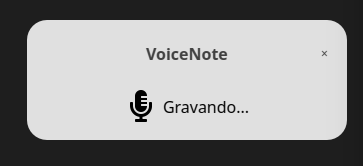
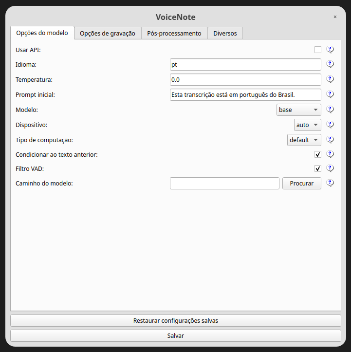

#  VoiceNote

<p align="center">
    
</p>

## Primeiros Passos

### Pré-requisitos
Antes de executar este aplicativo, você precisará ter os seguintes softwares instalados:

- Git: [https://git-scm.com/downloads](https://git-scm.com/downloads)
- Python `3.11` ou mais recente: [https://www.python.org/downloads/](https://www.python.org/downloads/)
- [Poetry](https://python-poetry.org/docs/#installation): gerenciamento de dependências e ambiente virtual
- **Linux:** `xdotool` e `xclip` para inserir texto em outros aplicativos

Se quiser executar o `faster-whisper` na sua GPU, também será necessário instalar as seguintes bibliotecas NVIDIA:

- [cuBLAS para CUDA 12](https://developer.nvidia.com/cublas)
- [cuDNN 8 para CUDA 12](https://developer.nvidia.com/cudnn)

<details>
<summary>Mais informações sobre execução na GPU</summary>

O conteúdo abaixo foi extraído diretamente do [README do `faster-whisper`](https://github.com/SYSTRAN/faster-whisper?tab=readme-ov-file#gpu):

**Nota:** As versões mais recentes do `ctranslate2` suportam apenas CUDA 12. Para CUDA 11, a solução atual é fazer o downgrade para a versão `3.24.0` do `ctranslate2` (isso pode ser feito com `poetry add ctranslate2@3.24.0`).

Existem várias formas de instalar as bibliotecas NVIDIA mencionadas acima. A forma recomendada está descrita na documentação oficial da NVIDIA, mas também sugerimos outros métodos de instalação abaixo.

#### Usar Docker

As bibliotecas (cuBLAS, cuDNN) já estão instaladas nestas imagens Docker oficiais da NVIDIA CUDA: `nvidia/cuda:12.0.0-runtime-ubuntu20.04` ou `nvidia/cuda:12.0.0-runtime-ubuntu22.04`.

#### Instalar com `pip` (somente Linux)

No Linux, essas bibliotecas podem ser instaladas com `pip`. Note que `LD_LIBRARY_PATH` deve ser definido antes de iniciar o Python. Se você usar o Poetry, execute esses comandos dentro do ambiente do projeto com `poetry run pip install ...`.

```bash
poetry run pip install nvidia-cublas-cu12 nvidia-cudnn-cu12

export LD_LIBRARY_PATH=`poetry run python -c 'import os; import nvidia.cublas.lib; import nvidia.cudnn.lib; print(os.path.dirname(nvidia.cublas.lib.__file__) + ":" + os.path.dirname(nvidia.cudnn.lib.__file__))'`
```

**Nota**: A versão 9+ do `nvidia-cudnn-cu12` pode causar problemas devido à sua dependência do cuDNN 9 (o Faster-Whisper não suporta cuDNN 9 atualmente). Certifique-se de que sua versão do pacote Python seja para cuDNN 8.

#### Baixar as bibliotecas do repositório do Purfview (Windows e Linux)

O [whisper-standalone-win](https://github.com/Purfview/whisper-standalone-win) do Purfview fornece as bibliotecas NVIDIA necessárias para Windows e Linux em um [único arquivo compactado](https://github.com/Purfview/whisper-standalone-win/releases/tag/libs). Descompacte o arquivo e coloque as bibliotecas em um diretório incluído no `PATH`.

</details>

### Instalação
Para configurar e executar o projeto, siga estes passos:

#### 1. Clone o repositório:

```bash
git clone https://github.com/JoseBarreto1/voice-note-linux
cd whisper-writer
```

#### 2. Instale as dependências com o [Poetry](https://python-poetry.org/docs/#installation):

```bash
poetry install
```

#### 3. Linux: instale as ferramentas de sistema para teclado e área de transferência

No Linux, o aplicativo precisa do **xdotool** e do **xclip** para inserir o texto transcrito em outros aplicativos (ex.: editores de texto). Sem eles, a transcrição funciona, mas o texto não aparecerá na janela em foco.

```bash
sudo apt install xdotool xclip
```

Para detecção de atalhos de teclado, use `input_backend: pynput` nas Configurações (recomendado no Linux sem o grupo `input`). Alternativamente, adicione seu usuário ao grupo `input` para habilitar o backend `evdev`:

```bash
sudo usermod -aG input $USER
# encerre a sessão e entre novamente para que a alteração do grupo tenha efeito
```

#### 4. Execute o aplicativo:

```bash
poetry run python run.py
```

#### 5. Configure e inicie o VoiceNote

Na primeira execução, uma janela de Configurações deverá aparecer. Após configurar e salvar, outra janela será aberta. Clique em **Iniciar** para ativar o listener de teclado.

**Antes de ditar:**
1. Abra o aplicativo de destino (Bloco de Notas, navegador, terminal, etc.)
2. Clique dentro do campo de texto para que o cursor fique ativo
3. Pressione a tecla de ativação (`ctrl+shift+space` por padrão) e fale

O texto transcrito é colado na janela que estiver em foco no momento.

### Scripts de diagnóstico

Se algo não estiver funcionando, execute estes scripts a partir da raiz do projeto:

| Script | Finalidade |
|--------|---------|
| `poetry run python scripts/test_mic.py --full` | Testa a captura do microfone e a transcrição |
| `poetry run python scripts/test_hotkey.py` | Testa se o atalho de ativação é detectado |
| `poetry run python scripts/test_typing.py` | Testa se o texto é inserido na janela em foco |

Listar dispositivos de entrada de áudio:

```bash
poetry run python -m sounddevice
```

No Linux, prefira o dispositivo **pipewire** ou **default** em vez de dispositivos de hardware ALSA diretos (ex.: `ALC257 Analog`), que podem não suportar gravação a 16 kHz. Deixe `sound_device` vazio para usar o padrão do sistema, ou defina o índice do dispositivo mostrado pelo comando acima.

### Opções de Configuração

O VoiceNote usa um arquivo de configuração para personalizar seu comportamento. Para abrir as configurações, acesse a janela de Configurações:

<p align="center">
    
</p>

#### Opções do Modelo
- `use_api`: Alterna entre usar a API da OpenAI ou um modelo Voice local para transcrição. (Padrão: `false`)
- `common`: Opções comuns a ambos os modelos (API e local).
  - `language`: O código de idioma para a transcrição no [formato ISO-639-1](https://en.wikipedia.org/wiki/List_of_ISO_639_language_codes). (Padrão: `null`)
  - `temperature`: Controla a aleatoriedade da saída da transcrição. Valores mais baixos tornam a saída mais focada e determinística. (Padrão: `0.0`)
  - `initial_prompt`: Uma string usada como prompt inicial para condicionar a transcrição. Mais informações: [Guia de Prompting da OpenAI](https://platform.openai.com/docs/guides/speech-to-text/prompting). (Padrão: `null`)

- `api`: Opções de configuração para a API da OpenAI. Consulte a [documentação da API da OpenAI](https://platform.openai.com/docs/api-reference/audio/create?lang=python) para mais informações.
  - `model`: O modelo a ser usado para transcrição. Atualmente, apenas `whisper-1` está disponível. (Padrão: `whisper-1`)
  - `base_url`: A URL base da API. Pode ser alterada para usar um endpoint de API local, como o [LocalAI](https://localai.io/). (Padrão: `https://api.openai.com/v1`)
  - `api_key`: Sua chave de API para a API da OpenAI. Necessária para uso não local da API. (Padrão: `null`)

- `local`: Opções de configuração para o modelo Voice local.
  - `model`: O modelo a ser usado para transcrição. Modelos maiores oferecem melhor precisão, mas são mais lentos. Veja [modelos e idiomas disponíveis](https://github.com/openai/whisper?tab=readme-ov-file#available-models-and-languages). (Padrão: `base`)
  - `device`: O dispositivo para executar o modelo Voice local. Use `cuda` para GPUs NVIDIA, `cpu` para processamento somente por CPU, ou `auto` para usar a GPU apenas quando as bibliotecas CUDA estiverem disponíveis (com fallback para CPU). (Padrão: `auto`)
  - `compute_type`: O tipo de computação para o modelo Voice local. [Mais informações sobre quantização aqui](https://opennmt.net/CTranslate2/quantization.html). (Padrão: `default`)
  - `condition_on_previous_text`: Defina como `true` para usar o texto transcrito anteriormente como prompt para a próxima requisição de transcrição. (Padrão: `true`)
  - `vad_filter`: Defina como `true` para usar [um filtro de detecção de atividade de voz (VAD)](https://github.com/snakers4/silero-vad) para remover silêncio da gravação. (Padrão: `false`)
  - `model_path`: O caminho para o modelo Voice local. Se não especificado, o modelo padrão será baixado. (Padrão: `null`)

#### Opções de Gravação
- `activation_key`: O atalho de teclado para ativar o processo de gravação e transcrição. Separe as teclas com `+`. (Padrão: `ctrl+shift+space`)
- `input_backend`: O backend de entrada para detectar pressionamentos de tecla. No Linux, use `pynput` a menos que seu usuário esteja no grupo `input`. `auto` escolhe o primeiro backend disponível. (Padrão: `auto`)
- `recording_mode`: O modo de gravação a ser usado. As opções incluem `continuous` (reinicia automaticamente a gravação após pausa na fala até que a tecla de ativação seja pressionada novamente), `voice_activity_detection` (para a gravação após pausa na fala), `press_to_toggle` (para a gravação quando a tecla de ativação é pressionada novamente), `hold_to_record` (para a gravação quando a tecla de ativação é solta). (Padrão: `continuous`)
- `sound_device`: O índice numérico do dispositivo de som a ser usado para gravação. Para encontrar os números dos dispositivos, execute `poetry run python -m sounddevice`. (Padrão: `null`)
- `sample_rate`: A taxa de amostragem em Hz para gravação. (Padrão: `16000`)
- `silence_duration`: A duração em milissegundos para aguardar o silêncio antes de parar a gravação. (Padrão: `900`)
- `min_duration`: A duração mínima em milissegundos para que uma gravação seja processada. Gravações mais curtas que isso serão descartadas. (Padrão: `100`)
- `enable_audio_enhancement`: Aplica filtros de áudio antes da transcrição para reduzir ruído. (Padrão: `true`)
- `highpass_cutoff_hz`: Frequência de corte do filtro passa-alta em Hz — remove rumble e ruído grave. Use `0` para desativar. (Padrão: `80`)
- `noise_reduction_strength`: Intensidade da redução de ruído espectral, de `0.0` (desligado) a `1.0` (máximo). (Padrão: `0.75`)
- `noise_profile_ms`: Milissegundos iniciais da gravação usados para estimar o ruído ambiente. (Padrão: `300`)
- `normalize_audio`: Normaliza o volume do áudio antes da transcrição. (Padrão: `true`)

#### Opções de Pós-processamento
- `writing_key_press_delay`: O atraso em segundos entre cada pressionamento de tecla ao escrever o texto transcrito. (Padrão: `0.005`)
- `remove_trailing_period`: Defina como `true` para remover o ponto final do texto transcrito. (Padrão: `false`)
- `add_trailing_space`: Defina como `true` para adicionar um espaço ao final do texto transcrito. (Padrão: `true`)
- `remove_capitalization`: Defina como `true` para converter o texto transcrito para letras minúsculas. (Padrão: `false`)
- `input_method`: Como o texto transcrito é inserido na janela ativa. (Padrão: `auto`)
  - `auto`: Usa colagem via área de transferência com `xdotool` quando disponível (recomendado no Linux)
  - `clipboard`: Copia para a área de transferência e cola com `Ctrl+V`
  - `xdotool`: Digita o texto caractere por caractere via `xdotool`
  - `pynput`: Simula pressionamentos de tecla via `pynput` (pode não funcionar no Linux para outros aplicativos)
  - `ydotool` / `dotool`: Ferramentas alternativas para Wayland ou outros ambientes

#### Opções Diversas
- `print_to_terminal`: Defina como `true` para imprimir o status do script e o texto transcrito no terminal. (Padrão: `true`)
- `hide_status_window`: Defina como `true` para ocultar a janela de status durante a operação. (Padrão: `false`)
- `noise_on_completion`: Defina como `true` para reproduzir um som após o texto transcrito ser digitado. (Padrão: `false`)

Se alguma das opções de configuração for inválida ou não fornecida, o programa usará os valores padrão.

A configuração é armazenada em `src/config.yaml` após o primeiro salvamento.

## Solução de Problemas

### A transcrição aparece no terminal, mas não no editor

- Instale `xdotool` e `xclip`: `sudo apt install xdotool xclip`
- Execute `poetry run python scripts/test_typing.py` para verificar a inserção de texto
- Certifique-se de que o aplicativo de destino esteja em foco (cursor piscando) antes e durante a ditação
- Defina `input_method` como `auto` ou `clipboard` nas Configurações

### O atalho de ativação não faz nada

- Clique em **Iniciar** na janela principal antes de usar o atalho
- Execute `poetry run python scripts/test_hotkey.py` para verificar a detecção do atalho
- No Linux, defina `input_backend` como `pynput` nas Configurações
- Verifique se o atalho conflita com uma ligação do sistema ou do ambiente de desktop

### O microfone não está capturando áudio

- Execute `poetry run python scripts/test_mic.py --full`
- Liste os dispositivos com `poetry run python -m sounddevice`
- No Linux, use o dispositivo **pipewire** ou **default** em vez de hardware ALSA direto
- Se estiver usando um dispositivo de hardware ALSA, o aplicativo grava automaticamente em uma taxa de amostragem suportada (ex.: 48 kHz) e converte para 16 kHz

### Erros de GPU / CUDA (`libcublas.so.12 not found`)

- Defina `device` como `auto` ou `cpu` nas Configurações — o aplicativo usa CPU como fallback quando as bibliotecas CUDA não estão disponíveis
- Para habilitar a GPU, instale as bibliotecas NVIDIA descritas em **Mais informações sobre execução na GPU** acima

### Transcrições vazias ou muito curtas

- Fale claramente e aguarde a janela de status mostrar **Gravando...**
- Aumente `silence_duration` se a gravação parar muito cedo
- Verifique a saída do terminal com `print_to_terminal: true`

## Build

Para gerar um executável standalone do VoiceNote, é necessário ter o [Poetry](https://python-poetry.org/) instalado e as dependências do projeto configuradas.

### Pré-requisitos

Instale as dependências do projeto:

```bash
poetry install
```

### Gerando o executável

```bash
poetry run pyinstaller -F -w \
  --icon=assets/logo.ico \
  --name=VoiceNote \
  --paths=src \
  --add-data="assets:assets" \
  --add-data="src/config_schema.yaml:." \
  --additional-hooks-dir=hooks \
  --hidden-import="PyQt5.QtGui" \
  --hidden-import="PyQt5.QtCore" \
  --hidden-import="PyQt5.QtWidgets" \
  --hidden-import="PyQt5.sip" \
  --hidden-import="onnxruntime" \
  --collect-all="scipy" \
  --collect-all="PyQt5" \
  run.py
```

O executável será gerado em `dist/VoiceNote`.

### Observações

- O arquivo `config.yaml` gerado após a primeira execução ficará salvo no mesmo diretório do executável (`dist/`)
- O hook `hooks/hook-faster_whisper.py` inclui o modelo VAD (`silero_vad.onnx`) necessário quando `vad_filter` está habilitado
- No GNOME, o ícone da bandeja exige a extensão [AppIndicator](https://extensions.gnome.org/extension/615/appindicator-support/) (`gnome-shell-extension-appindicator`). Sem ela, o app continua funcionando, mas o ícone não aparece na barra superior
- Para uso com GPU NVIDIA, certifique-se de que a `libcublas12` está instalada no sistema:
```bash
  sudo apt install libcublas12
```
- Os diretórios `build/`, `dist/` e arquivos `*.spec` são gerados automaticamente e não devem ser versionados

## Licença

Este projeto está licenciado sob a Licença Pública Geral GNU. Consulte o arquivo [LICENSE](LICENSE) para mais detalhes.